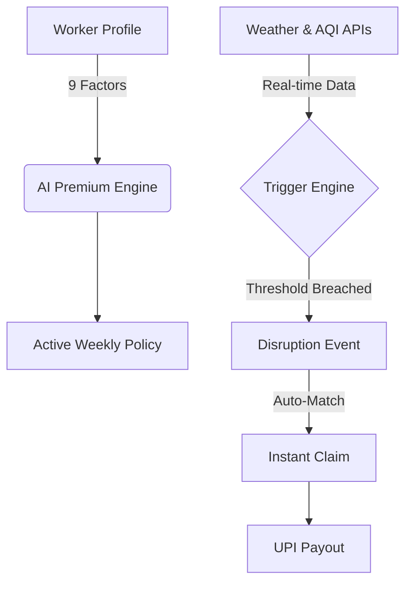

# GigShield — AI-Powered Parametric Insurance for India's Gig Workers

> **Guidewire DEVTrails 2026 | Unicorn Chase | Phase 1 Submission**

[](https://gig-workers.onrender.com/)
[](https://youtu.be/RJyxeHbifNI)


---

## 💡 The Vision

Every single day, 7.7 million gig delivery partners across India wake up to a fundamental uncertainty. They don't just fight traffic; they fight the elements. When the monsoon floods Mumbai's arterial roads or Delhi's air quality turns toxic, these workers face a choice no one should have to make: **risk their health on the road, or lose the income that puts food on their table.**

In the gig economy, there is no "sick leave." There is no "weather day." If you don't deliver, you don't earn.

**GigShield is the safety net they've been waiting for.** We've built an AI-powered parametric insurance platform that doesn't just promise protection—it automates it. By monitoring real-time environmental data, GigShield detects disruptions as they happen and triggers instant payouts before the rain even stops.

---

## 👤 The Human at the Center: Rahul’s Story

To understand GigShield, you have to understand **Rahul**. 

Rahul is 24. He delivers for Swiggy in Mumbai. He earns roughly **₹4,500 a week**, navigating the chaos of Andheri on a motorcycle. During the monsoon, Rahul loses an average of 6 working days a month. That’s nearly **₹4,000 in lost income** every single month—money meant for rent and his family back home.

> [!IMPORTANT]
> **The Gap:** Traditional insurance is too slow, too expensive, and buried in paperwork. Rahul doesn't have time to file a claim; he has deliveries to make.

**GigShield’s Promise to Rahul:**
*   **No Paperwork:** We monitor the rain so you don't have to.
*   **Weekly Cycle:** Your premium matches your payout schedule.
*   **Instant Peace of Mind:** If the city shuts down, your income doesn't.

---

## 🚀 What GigShield Does

GigShield is a "Zero-Touch" insurance experience. We replace subjective assessments with **Parametric Triggers** — objective, verifiable data points that trigger action.

*   **Auto-Triggered Claims:** When rainfall hits 30mm/hr or AQI crosses 400, our system identifies every affected worker and initiates a payout automatically.
*   **Dynamic, Fair Pricing:** Our 9-factor AI engine ensures you never pay more than your actual risk. We look at your city, your vehicle, your shift, and even your experience to find the perfect rate.
*   **Transparency First:** Every rupee is accounted for. Workers see exactly why their premium changed and when their payout is coming.

---

## 🛠️ The Innovation: How It’s Built

### End-to-End Architecture



### The Tech Stack

| Layer | Chosen Technology | Why it matters |
|-------|-------------------|----------------|
| **Core** | Django 5.x + Python | Industrial-strength reliability and rapid deployment. |
| **Data** | PostgreSQL + SQLite | High-concurrency support with easy local development. |
| **Intelligence** | Scikit-Learn + Pandas | The foundation for our multi-phase AI scaling strategy. |
| **Real-time** | OpenWeatherMap + WAQI | Verified, third-party data sources for parametric integrity. |
| **Experience** | Vanilla JS + Glassmorphism | A premium, lightning-fast UI that works on any device. |

---

## 🧠 Strategic AI Roadmap

We believe in **Transparent AI**. Our roadmap moves from verifiable rules to high-performance predictive models.

### Phase 1: The Expert Rule Engine (Current)
We use a sophisticated 9-factor multiplicative model calibrated on historical Indian weather data. Every decision is stored in an audit trail (`PremiumCalculation`), ensuring complete transparency for regulators and users alike.

### Phase 2: Predictive Tuning (Weeks 3-4)
Transitioning to an **XGBoost** model to hyper-calibrate premiums. By training on the claims data we are generating now, the AI will learn exactly how city-specific disruptions affect different vehicle types.

### Phase 3: Ethical Guardrails (Weeks 5-6)
Implementing **Anomaly Detection (Isolation Forest)** to protect the pool from fraud while ensuring 99.9% of honest claims remain completely automated.

---

## 📉 Market Crash Resilience

In the **Unicorn Chase**, survival is as important as growth. GigShield is structurally built for economic downturns:

1.  **Counter-Cyclical Demand:** When the formal economy slows down, more people enter gig work. Our target market actually *expands* during a crash.
2.  **Zero-Touch Operations:** Unlike traditional insurers with massive overhead, our "adjuster" is a line of code. Our fixed costs remain near zero regardless of claim volume.
3.  **Weekly Cash Velocity:** We collect and disburse weekly. This gives us 4x the financial agility of monthly competitors, allowing for real-time premium adjustments.

---

## 🏁 Phase 1 Result: Deployment

GigShield is fully functional and ready for evaluation.

*   **Live Platform:** [gig-workers.onrender.com](https://gig-workers.onrender.com/)
*   **Video Pitch:** [View the 5-minute Demo](https://youtu.be/RJyxeHbifNI)
*   **Admin Access:** Use `admin / admin123` to view the command center.
*   **Worker Access:** Use `demo_worker / worker123` to experience the dashboard.

---

## 📂 Project Governance

```
devtrails/
├── accounts/          # User Identity & AI Risk Profiling
├── policies/          # The 9-Factor Premium Engine
├── claims/            # The Parametric Trigger System
├── analytics/         # Worker & Admin Intelligence Dashboards
└── external_apis/     # High-Reliability Weather & AQI Integration
```

---

> [!NOTE]
> **Guidewire DEVTrails 2026**
> Built with heart for the people who keep our cities moving. Because your hard work deserves protection, rain or shine.
